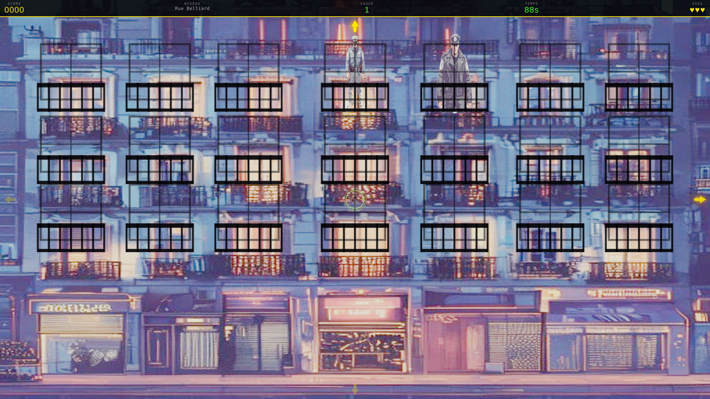
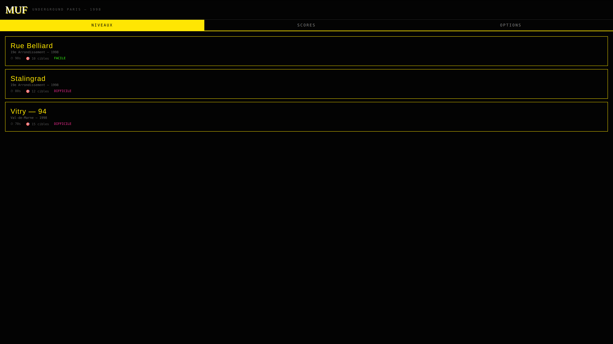
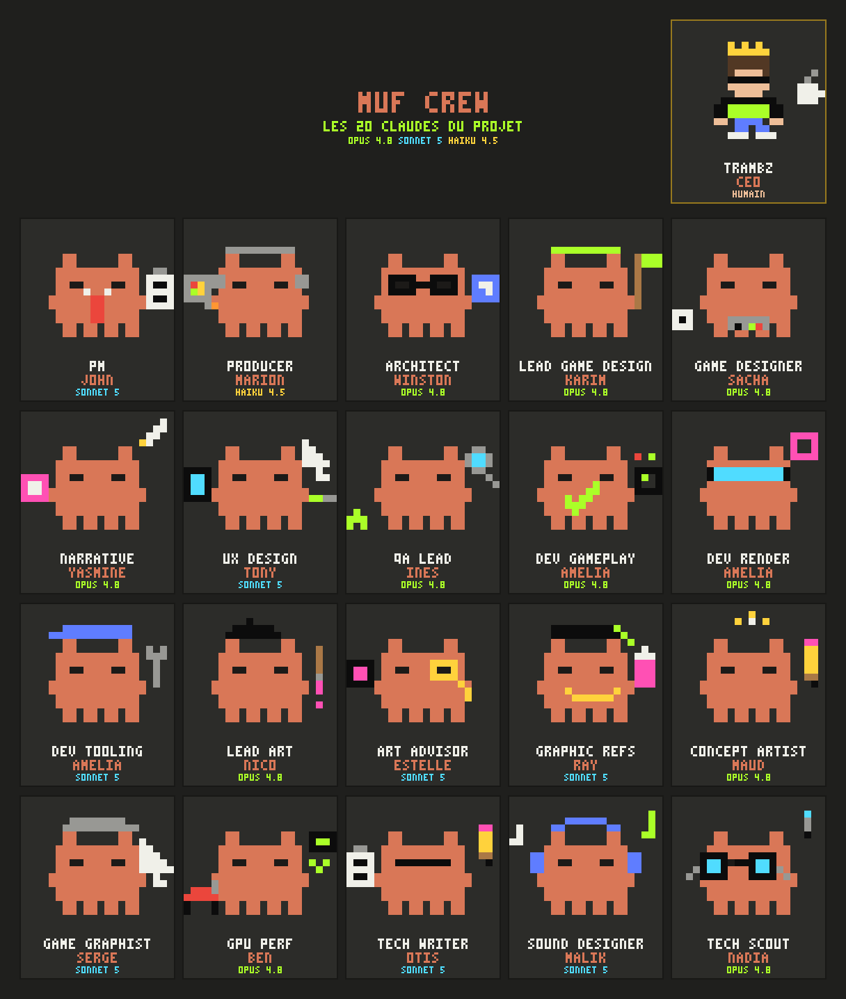

# muf

**muf** est un remake navigateur de _Prohibition_ (Atari ST, 1987), transposé
dans la **scène rave clandestine parisienne de la fin des années 90**. On y
incarne un coursier d'un réseau de fêtes underground qui livre matériel son,
flyers et groupes électrogènes à travers Paris, en évitant la BAC, les CRS et
les RG en civil.

L'identité visuelle est celle d'un **fanzine photocopié noir & blanc** rehaussé
de **néons acides** — des sprites 2D plats façon _Paper Mario_ dans un monde 3D
React Three Fiber.

[](https://github.com/bczy/prohimuf/actions/workflows/ci.yml)
[](https://bczy.github.io/prohimuf/)
[](https://react.dev)
[](https://www.typescriptlang.org)

**▶️ [Jouer en ligne](https://bczy.github.io/prohimuf/)**



> **État actuel :** le prototype implémente la **phase de tir** (_shooting
> gallery_) : des cibles apparaissent aux fenêtres et sur les balcons des
> façades, ripostent, et doivent être éliminées avant la fin du chrono — tout en
> épargnant les civils.

---

## Comment jouer

| Action            | Commande                                       |
| ----------------- | ---------------------------------------------- |
| Viser             | Déplacer la souris (le viseur suit)            |
| Tirer             | Clic gauche                                    |
| Balayer la façade | `W A S D` ou les flèches directionnelles       |
| Recommencer       | `R`                                            |
| Tactile (mobile)  | Toucher pour viser/tirer, glisser pour balayer |

Trois niveaux jouables : **Rue Belliard** (facile), **Stalingrad** (difficile) et
**Vitry — 94** (difficile). Chrono, vagues et vies s'affichent dans le HUD.

---

## Captures

|                      Menu                       |                           Fin de partie                           |
| :---------------------------------------------: | :---------------------------------------------------------------: |
|  |  |

---

## Stack technique

| Couche                  | Technologie                            |
| ----------------------- | -------------------------------------- |
| Framework               | React 19                               |
| Rendu 3D                | React Three Fiber + Three.js           |
| Langage                 | TypeScript (strict)                    |
| Build / dev             | Vite                                   |
| Tests                   | Vitest                                 |
| Audio                   | Howler.js                              |
| Gestionnaire de paquets | Yarn 4 (node-modules linker)           |
| Génération d'assets     | Pollinations.ai (modèle FLUX, gratuit) |

---

## Démarrage rapide

Prérequis : **Node.js** et **Yarn 4** (activé via Corepack).

```bash
corepack enable          # active Yarn 4 si nécessaire
yarn install             # installe les dépendances
yarn dev                 # lance le serveur de dev Vite
```

Ouvrez ensuite l'URL affichée par Vite (par défaut `http://localhost:5173`).

---

## Scripts disponibles

| Commande             | Description                                      |
| -------------------- | ------------------------------------------------ |
| `yarn dev`           | Serveur de développement Vite (HMR)              |
| `yarn build`         | Vérification de types puis build de production   |
| `yarn preview`       | Prévisualise le build de production              |
| `yarn typecheck`     | Vérification TypeScript sans émettre de fichiers |
| `yarn lint`          | Analyse ESLint                                   |
| `yarn lint:fix`      | ESLint avec correction automatique               |
| `yarn format`        | Formatage Prettier                               |
| `yarn format:check`  | Vérifie le formatage sans modifier               |
| `yarn test`          | Lance la suite de tests Vitest                   |
| `yarn test:watch`    | Tests en mode watch                              |
| `yarn test:coverage` | Tests avec rapport de couverture                 |

---

## Architecture

Le projet impose une **séparation stricte entre logique de jeu et rendu** : la
logique de jeu n'importe jamais React/Three, et le rendu ne détient jamais de
règle. Les hooks React sont l'unique pont entre les deux.

```
src/
├── game/        # Logique de jeu pure — zéro dépendance React/Three
│   ├── types/   # Définitions de types partagées (GameState, Enemy, Bullet…)
│   ├── systems/ # Fonctions pures (state-in / state-out) + tests Vitest
│   ├── maps/    # Fixtures de façade (FacadeMap) pour les tests
│   ├── levels/  # Définition des niveaux (art PNG + zones de fenêtres)
│   ├── entities/ & state/  # Fabriques d'entités et d'état
├── hooks/       # Hooks React — pont entre logique de jeu et R3F (useFrame)
├── render/
│   ├── scene/   # Composants de scène R3F (App, GameScene, LevelBackdrop, sprites…)
│   └── ui/      # Overlays HTML (HUD, TitleScreen, EndScreen…)
├── assets/      # Audio + sprites générés (PNG)
└── main.tsx     # Point d'entrée
```

### Principes de conception

- **Logique pure :** tout dans `src/game/` est du TypeScript sans import React
  ni Three.js — testable sans DOM/WebGL, déterministe, portable.
- **État immuable :** `GameState` est en lecture seule ; chaque tick renvoie un
  nouvel objet d'état, sans mutation.
- **TDD / YAGNI / DRY :** tests écrits avant les fonctions système ; pas de
  fonctionnalité ni d'abstraction prématurée.

Les hooks React (`src/hooks/`) s'abonnent à la boucle `useFrame` de R3F,
appellent les fonctions système pures, puis mettent à jour des refs lues par les
composants de rendu (sans déclencher de re-render).

---

## Documentation

La documentation détaillée se trouve dans [`docs/`](./docs) :

- [`overview.md`](./docs/overview.md) — vision, univers, boucle de gameplay
- [`architecture.md`](./docs/architecture.md) — architecture, data flow, caméra, stack
- [`game-systems.md`](./docs/game-systems.md) — systèmes de jeu (state machine, ennemis, balles, viseur)
- [`render-layer.md`](./docs/render-layer.md) — scène R3F, décor de niveau (LevelBackdrop), sprites, HUD
- [`audio-system.md`](./docs/audio-system.md) — audio Howler.js, paliers de tension, BGM/SFX
- [`asset-pipeline.md`](./docs/asset-pipeline.md) — génération d'assets (Pollinations.ai)
- [`dev-guidelines.md`](./docs/dev-guidelines.md) — standards de code (TDD, YAGNI, DRY)
- [`roadmap.md`](./docs/roadmap.md) — sprints réalisés, fonctionnalités prévues, manques connus

---

## L'équipe d'agents

muf est développé par un **équipage de 20 sous-agents** (chacun incarnant une
persona BMAD) qui travaillent en parallèle sur des chemins disjoints et se
coordonnent via [`docs/agent-handoffs.md`](./docs/agent-handoffs.md). Chaque
fiche vit dans [`.claude/agents/`](./.claude/agents) ; le protocole complet est
dans [`COLLABORATION.md`](./.claude/agents/COLLABORATION.md).



> Bitmap généré par [`docs/muf-crew-bitmap.py`](./docs/muf-crew-bitmap.py).

### Le roster

| Pôle                   | Agents                                                                                 |
| ---------------------- | -------------------------------------------------------------------------------------- |
| **Produit & pilotage** | `pm` · `producer`                                                                      |
| **Architecture & R&D** | `senior-architect` · `tech-scout`                                                      |
| **Design**             | `lead-game-designer` · `game-designer` · `narrative-designer` · `ux-designer`          |
| **Développement**      | `dev-gameplay` · `dev-r3f-render` · `dev-tooling-assets`                               |
| **Art**                | `lead-art` · `art-advisor` · `graphic-references` · `concept-artist` · `game-graphist` |
| **Audio**              | `sound-designer`                                                                       |
| **Qualité & docs**     | `qa-lead` · `gpu-specialist` · `tech-writer`                                           |

### Le pipeline

Chaque story descend une chaîne de production hand-to-hand (le détail, avec le
diagramme mermaid, est dans
[`docs/diagrams/agent-workflows.md`](./docs/diagrams/agent-workflows.md)) :

```
pm (quoi)  →  boucle de design (game + narrative + ux → gate lead-game-designer)
           →  senior-architect (comment + découpe des lanes)
           →  lanes dev ∥ lane art  →  verify (qa-lead : tsc/vitest/lint + e2e + playtest)
           →  panel code-review (4 reviewers, merge gate)  →  pm accepte
```

Un petit correctif mono-lane suit une **voie FIX** allégée (dev → tsc/vitest/lint
→ un seul reviewer → merge). Le garde-fou de périmètre est
toujours le même : _« Prohibition Atari ST 1987 avait-il cette fonctionnalité ? »_

---

## Génération d'assets

Les sprites sont générés via `scripts/generate-assets.mjs` (API Pollinations.ai,
modèle FLUX gratuit). Copiez `.env.example` vers `.env` et renseignez la clé si
nécessaire :

```bash
cp .env.example .env
```

---

## Audio credits / licences

Les cinq pistes de musique (BGM) sont de **Kevin MacLeod** (incompetech.com),
sous licence **Creative Commons: By Attribution 4.0 (CC-BY 4.0)** — l'attribution
est obligatoire. La source de vérité est le fichier livré avec le build :
[`public/assets/audio/CREDITS.md`](./public/assets/audio/CREDITS.md).

| Fichier           | Titre         | Auteur        | Licence   |
| ----------------- | ------------- | ------------- | --------- |
| `bgm_loop.mp3`    | Funky Chunk   | Kevin MacLeod | CC-BY 4.0 |
| `bgm_loop2.mp3`   | Ouroboros     | Kevin MacLeod | CC-BY 4.0 |
| `bgm_tension.mp3` | Sneaky Snitch | Kevin MacLeod | CC-BY 4.0 |
| `bgm_danger.mp3`  | Darkest Child | Kevin MacLeod | CC-BY 4.0 |
| `bgm_win.mp3`     | Reformat      | Kevin MacLeod | CC-BY 4.0 |

Attribution (norme CC-BY 4.0), ex. : `"Funky Chunk" Kevin MacLeod
(incompetech.com) — Licensed under Creative Commons: By Attribution 4.0 —
https://creativecommons.org/licenses/by/4.0/`

`shoot.wav` est de **provenance inconnue** et signalé pour remplacement — voir
[`CREDITS.md`](./public/assets/audio/CREDITS.md) pour le détail de l'enquête.

---

## Licence

Projet personnel / prototype — voir le dépôt pour les détails.
