# Agent Workflows — The Production Pipeline

Visual companion to [`.claude/agents/COLLABORATION.md`](../../.claude/agents/COLLABORATION.md)
(the normative protocol). One pipeline: every feature passes hand to hand through stages
0-8 — product → design → tech plan → build (dev ∥ art ∥ audio) → verify → review
(panel + integration triage) → accept → merge — driven by the `producer`. Small
single-lane fixes take the **fix lane** instead (COLLABORATION.md §fix lane): owning
dev lane → mechanical checks → ONE `code-review` (high) reviewer → merge. Every gate
verdict and hand-off is logged in the story's shard under
[`docs/handoffs/`](../handoffs/) (index: [`agent-handoffs.md`](../agent-handoffs.md)).

A styled poster version of this pipeline lives at
[`agents-pipeline-infographic.html`](./agents-pipeline-infographic.html) (standalone
HTML, crew sprites from `docs/muf-crew-bitmap.py --singles`). It is kept fresh by
`scripts/check-agents-infographic.mjs` (runs in CI): any PR touching this file,
`.claude/agents/*.md`, or the crew bitmap script must update the infographic and
re-pin its manifest with `node scripts/check-agents-infographic.mjs --update`.

```mermaid
flowchart TB
    B(("Bertrand<br/>(CEO)"))
    PROD["producer · Marion 📆<br/>pipeline state, hand-off chasing,<br/>caps &amp; escalations, sprint status"]

    B -->|"0. INTAKE — intent, bug, idea"| PM

    subgraph P1["1. PRODUCT"]
        PM["pm · John 📋<br/>scoped story, scope guard,<br/>acceptance criteria"]
    end

    subgraph P2["2. DESIGN — only when gameplay, fiction or screens/flows/accessibility are touched"]
        direction TB
        GD["game-designer · Sacha 🎮<br/>mechanics, tuning values, 3C specs"]
        ND["narrative-designer · Yasmine ✒️<br/>universe, cast, scripts"]
        UXD["ux-designer · Tony 🖱️<br/>screens/flows, HUD ergonomics,<br/>accessibility specs"]
        DGATE{"lead-game-designer · Karim 🧭<br/>DESIGN GATE<br/>scope · core loop · verifiability · coherence"}
        GD --> DGATE
        ND --> DGATE
        UXD --> DGATE
        DGATE -->|"FAIL · max 2 rework rounds"| GD
        DGATE -->|"FAIL"| ND
        DGATE -->|"FAIL"| UXD
    end

    PM -->|"gameplay/fiction story —<br/>Karim splits &amp; sequences first"| GD
    PM -->|"gameplay/fiction story —<br/>Karim splits &amp; sequences first"| ND
    PM -->|"screens/flows/accessibility story —<br/>Karim splits &amp; sequences first"| UXD
    PM -->|"no gameplay/fiction/UX change<br/>(tech / tooling / art / audio only)"| ARCH
    DGATE -->|PASS| ARCH

    subgraph P3["3. TECH PLAN"]
        ARCH["senior-architect · Winston 🏗️<br/>boundaries, ADR if needed,<br/>lane partition (dev + art)"]
        SCOUT["tech-scout · Nadia 🔭<br/>prior-art / feasibility recon<br/>(deep-research; sourced report, no gate)"]
    end

    subgraph P4["4. BUILD — parallel, non-overlapping lanes"]
        direction TB
        subgraph DEVL["dev lanes"]
            R3F["dev-r3f-render · Amelia 🎨<br/>src/render + hooks (view side)"]
            GAME["dev-gameplay · Amelia 🧠<br/>src/game + hooks (logic side), TDD"]
            TOOL["dev-tooling-assets · Amelia 🛠️<br/>scripts/, levelArt.json (structure), CI"]
        end
        subgraph ARTL["art lane — when the feature needs new/changed visuals"]
            direction TB
            REFS["graphic-references · Ray 🗽<br/>reference hunt (optional):<br/>interview → web propositions →<br/>Bertrand verdicts → refine (max 3)"]
            ADV["art-advisor · Estelle 📼<br/>references, cultural grounding<br/>(advice only)"]
            CONCEPT["concept-artist · Maud ✍️<br/>FLUX prompts (levelArt.json)"]
            PREPROD["game-graphist · Serge 🕹️<br/>PRE-PROD PASS<br/>game-size readability, keying"]
            GATE1{"lead-art · Nico 🎯<br/>PROMPT GATE<br/>+ check-art-prompts.mjs (CI)"}
            GEN["CI generation<br/>marker push → render farm<br/>check-sprite-style.mjs + retries"]
            TECH["game-graphist · Serge 🕹️<br/>TECHNICAL PASS<br/>real-size inspection, cleanup"]
            GATE2{"lead-art · Nico 🎯<br/>ASSET GATE<br/>PASS/FAIL vs art-direction.md"}
            REFS -->|"validated board<br/>(curated by lead-art)"| ADV
            ADV --> CONCEPT
            CONCEPT --> PREPROD
            PREPROD -->|annotations integrated| GATE1
            GATE1 -->|PASS| GEN
            GATE1 -->|FAIL| CONCEPT
            GEN --> TECH
            TECH --> GATE2
            GATE2 -->|"FAIL · 1 variable/roll<br/>max 2 batches/cycle"| CONCEPT
        end
        subgraph AUDL["audio lane — when the feature needs sound"]
            direction TB
            SD["sound-designer · Malik 🎧<br/>audio specs: BGM tiers, SFX<br/>(ce qui sonne informe)"]
            SRC["sourcing / generation<br/>scripts/download-audio.mjs<br/>(dev-tooling-assets mechanics)"]
            AGATE{"sound-designer · Malik 🎧<br/>AUDIO GATE<br/>PASS/FAIL vs audio-direction.md"}
            SD --> SRC
            SRC --> AGATE
            AGATE -->|"FAIL · max 2 batches/cycle"| SD
        end
    end

    ARCH --> R3F
    ARCH --> GAME
    ARCH --> TOOL
    ARCH -.->|"assets needed"| ADV
    ARCH -.->|"references missing"| REFS
    B <-.->|"interview & verdicts<br/>(relayed rounds)"| REFS
    ARCH -.->|"sound needed"| SD

    subgraph P5["5. VERIFY — the test stage, orchestrated by qa-lead"]
        direction TB
        CHECKS["rtk tsc · rtk vitest (100%) · rtk lint<br/>+ e2e / verify runs (player-visible changes)<br/>per qa-lead's test plan (docs/qa/)"]
        SIMP["owning dev lane · simplify skill<br/>degrease the diff once green<br/>APPLIED (proven green) · PROPOSED → panel"]
        GATE4{"lead-art · Nico 🎯<br/>COMPOSITE GATE (Gate 4)<br/>runtime visuals on REAL screenshots"}
        PLAY["game-designer · Sacha 🎮<br/>PLAYTEST vs the gated spec"]
        UXR["ux-designer · Tony 🖱️<br/>UX REVIEW vs gated spec<br/>(real screenshots, both devices)"]
        DACC{"lead-game-designer · Karim 🧭<br/>DESIGN ACCEPTANCE"}
        SDV{"sound-designer · Malik 🎧<br/>behaviour verdict<br/>(audible changes)"}
        PERF{"gpu-specialist · Ben 🏍️<br/>PERF VERDICT vs perf-budget.md<br/>(perf-sensitive changes; on-target<br/>runs escalated as ready protocols)"}
        QGATE{"qa-lead · Inès 🧪<br/>QUALITY GATE<br/>plan ran and held"}
        CHECKS --> GATE4
        CHECKS --> SDV
        CHECKS --> PERF
        CHECKS --> PLAY
        CHECKS --> UXR
        PLAY --> DACC
        UXR --> DACC
        CHECKS --> QGATE
        CHECKS --> SIMP
        GATE4 -->|PASS| QGATE
        SDV -->|PASS| QGATE
        PERF -->|"PASS / DEFERRED-ON-TARGET<br/>(logged, chased by producer)"| QGATE
        DACC -->|PASS| QGATE
    end

    R3F --> CHECKS
    GAME --> CHECKS
    TOOL --> CHECKS
    GATE2 -->|PASS| CHECKS
    AGATE -->|PASS| CHECKS

    subgraph P6["6. REVIEW — panel + integration triage (one stage)"]
        direction TB
        PANEL["CODE-REVIEW PANEL (merge gate)<br/>4 parallel skills: code-review (high) ·<br/>bmad-code-review · edge-case-hunter ·<br/>security-review — findings<br/>adversarially verified"]
        TRIAGE["senior-architect · Winston 🏗️<br/>finding triage + INTEGRATION REVIEW<br/>cross-lane sign-off — one pass over the diff"]
        TW["tech-writer · Otis 📚<br/>DOCS lane: ADR drafting,<br/>doc realignments, doc↔code coherence"]
        PANEL --> TRIAGE
        TRIAGE -.->|"doc findings<br/>(ADR/bible/README/JSDoc)"| TW
    end

    ARCH -.->|"perf-sensitive:<br/>GPU-cost analysis at TECH PLAN"| PERF
    ARCH -.->|"unproven technique / model /<br/>API / dep: feasibility recon"| SCOUT

    QGATE -->|PASS| PANEL
    SIMP -.->|"PROPOSED cuts<br/>(candidate findings)"| PANEL
    QGATE -->|"FAIL → back to the owning lane,<br/>failing case named"| ARCH
    GATE4 -->|"FAIL → dev-r3f-render<br/>(the composite is render code)"| ARCH
    SDV -->|"FAIL → owning dev lane,<br/>or spec re-gated via Malik"| ARCH
    PERF -->|"FAIL → owning dev lane<br/>(on-target OVER, PR open: DEFERRED revoked,<br/>stage-5 FAIL, same branch · post-merge:<br/>fix lane + Ben's re-verdict, or correct-course<br/>at pm/arch if the remedy trades design)"| ARCH
    DACC -->|"FAIL → back to dev lane"| ARCH
    DACC -->|"spec amended &amp; re-gated"| DGATE

    subgraph P7["7. ACCEPT"]
        ACCEPT["pm · John 📋<br/>acceptance vs story<br/>+ PROJECT_GUIDELINES"]
    end

    TRIAGE -->|"zero CONFIRMED blocking/major"| ACCEPT
    ACCEPT -->|"8. MERGE to main"| B
    ACCEPT -->|"reject → owning lane"| ARCH

    LOG[("docs/handoffs/story-&lt;slug&gt;.md<br/>every hand-off + gate verdict<br/>(index: agent-handoffs.md)")]
    PROD -.->|"tracks stages, chases missing entries,<br/>enforces caps, serialises shared seams"| LOG
    PROD -.->|"escalation packets<br/>(caps hit, blockers)"| B
    DGATE -.-> LOG
    GATE1 -.-> LOG
    GATE2 -.-> LOG
    GATE4 -.-> LOG
    AGATE -.-> LOG
    DACC -.-> LOG
    PERF -.-> LOG
    QGATE -.-> LOG
    TRIAGE -.-> LOG
    TW -.-> LOG

    classDef gate fill:#ffe9a8,stroke:#b8860b,color:#000
    classDef dev fill:#d4e9ff,stroke:#2b6cb0,color:#000
    classDef art fill:#ffd9ec,stroke:#b83280,color:#000
    classDef design fill:#d9f2d9,stroke:#2f855a,color:#000
    classDef audio fill:#ffe4cc,stroke:#c05621,color:#000
    classDef ci fill:#e2e2e2,stroke:#666,color:#000
    classDef prod fill:#e9d8fd,stroke:#6b46c1,color:#000
    class DGATE,GATE1,GATE2,GATE4,AGATE,DACC,QGATE,SDV,PERF gate
    class R3F,GAME,TOOL dev
    class REFS,ADV,CONCEPT,PREPROD,TECH art
    class GD,ND,UXD,PLAY,UXR design
    class SD audio
    class GEN,SRC,LOG,CHECKS,PANEL,TW ci
    class PROD prod
```

## How to read it

- **The pipeline is one line, hand to hand.** A feature never skips a stage silently:
  a stage that does not apply (e.g. no DESIGN on a pure tooling story, no art lane when
  no visual changes) is skipped explicitly and the skip is logged.
- **Design loop (green)**: when a story touches how the game plays, its fiction, or its
  screens/flows/accessibility, `game-designer` (mechanics/tuning/3C), `narrative-designer`
  (universe/cast/scripts) and `ux-designer` (screens/flows/HUD ergonomics/accessibility)
  work in parallel on non-overlapping deliverables; `lead-game-designer` holds the
  blocking **design gate** (max 2 rework rounds, then escalation to Bertrand). No dev
  implements an ungated design.
- **Build (blue + pink + orange)**: `senior-architect` partitions parallel lanes on
  non-overlapping paths. The dev lanes' only routinely shared seam is `src/hooks/**`
  (serialised, never co-edited). The art lane keeps its two production passes
  (`game-graphist`) bracketing CI generation and its two blocking gates (`lead-art`).
  When a family lacks references (or Bertrand asks for a hunt), the lane opens with an
  interactive reference hunt: `graphic-references` (Ray) interviews Bertrand, proposes
  web-sourced directions, and refines on his KEEP/DROP/DIG verdicts (max 3 refine
  rounds, then escalation); the validated board lands in
  `docs/art-direction/references/boards/` and `lead-art` curates it into the library.
  The audio lane mirrors it: `sound-designer` (Malik) specs every cue ("ce qui sonne
  informe" — every audio cue is information), sourcing runs through the tooling
  scripts, and his **audio gate** verdicts assets and audible behaviour changes vs
  `docs/audio-direction.md`; what needs human ears is escalated to Bertrand as a
  shortlist, never passed blind.
- **Verify (stage 5) is the test stage**, orchestrated by `qa-lead` (Inès) against her
  per-story test plan (`docs/qa/`): mechanical checks (`rtk tsc`/`vitest`/`lint`,
  100% green) plus e2e/`verify` runs, the **composite gate** on real in-game screenshots
  for runtime-composed visuals, the **perf verdict** leg — `gpu-specialist` (Ben)
  verdicts perf-sensitive changes against `docs/perf-budget.md`, packaging what CI's
  SwiftShader cannot measure as ready-to-run on-target protocols escalated to Bertrand
  (DEFERRED-ON-TARGET, logged and chased by `producer`; an on-target result returning
  OVER budget while the PR is open revokes the DEFERRED pass — stage-5 FAIL, same
  branch — and after merge re-enters via the fix lane closed only by Ben's PERF
  re-verdict, or as a correct-course story at pm/architect when the remedy trades
  design) — and the **design
  acceptance** leg — `game-designer` playtests the build against the gated spec
  (`ux-designer` reviews built screens/flows on both device classes) and
  `lead-game-designer` verdicts; drift
  goes back to the dev lane or the spec is re-gated, never absorbed silently. Everything
  funnels into Inès's **quality gate**: PASS required before integration, FAIL routes
  back to the owning lane with the failing case named.
- **Review (stage 6)**: the mandatory **code-review panel** (4 parallel skills,
  findings adversarially verified), triaged by `senior-architect` — his triage pass IS
  the integration review and cross-lane sign-off (he reads the full diff once, not
  twice) — before any merge to `main`. DOC findings from the triage
  (ADR/bible/README/JSDoc realignments) route to `tech-writer` (Otis), the standing
  DOCS-lane owner.
- **The fix lane** bypasses the pipeline for small single-lane changes (no design, no
  asset, no dependency/boundary surface): owning dev lane → `rtk tsc`/`vitest`/`lint`
  (+ `verify` if player-visible) → a single `code-review` (high) reviewer → merge,
  logged as one line in `docs/handoffs/fixes.md`. Doubt ⇒ full pipeline.
- **Producer (purple)**: `producer` (Marion) drives the pipeline itself — she tracks
  which stage every feature is in, chases missing hand-offs in the log, enforces the
  bounded-iteration caps, serialises contended seams, and assembles escalation packets
  for Bertrand. She holds no gate and authors no content.
- Dotted arrows are logging and escalations: every hand-off and gate verdict lands in
  [`agent-handoffs.md`](../agent-handoffs.md).
