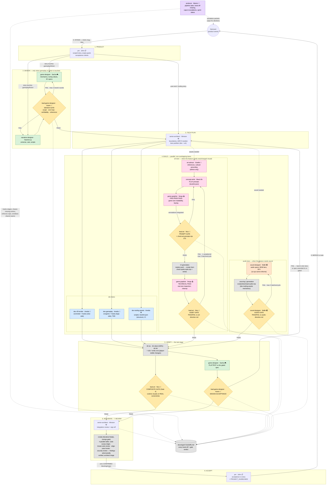

# Agent Workflows — The Production Pipeline

Visual companion to [`.claude/agents/COLLABORATION.md`](../../.claude/agents/COLLABORATION.md)
(the normative protocol). One pipeline: every feature passes hand to hand through stages
0-9 — product → design → tech plan → build (dev ∥ art ∥ audio) → verify → integrate →
review → accept → merge — driven by the `producer`. Every gate verdict and hand-off is
logged in [`agent-handoffs.md`](../agent-handoffs.md).

## How to read it

- **The pipeline is one line, hand to hand.** A feature never skips a stage silently:
  a stage that does not apply (e.g. no DESIGN on a pure tooling story, no art lane when
  no visual changes) is skipped explicitly and the skip is logged.
- **Design loop (green)**: when a story touches how the game plays or its fiction,
  `game-designer` (mechanics/tuning/3C) and `narrative-designer` (universe/cast/scripts)
  work in parallel on non-overlapping deliverables; `lead-game-designer` holds the
  blocking **design gate** (max 2 rework rounds, then escalation to Bertrand). No dev
  implements an ungated design.
- **Build (blue + pink + orange)**: `senior-architect` partitions parallel lanes on
  non-overlapping paths. The dev lanes' only routinely shared seam is `src/hooks/**`
  (serialised, never co-edited). The art lane keeps its two production passes
  (`game-graphist`) bracketing CI generation and its two blocking gates (`lead-art`).
  The audio lane mirrors it: `sound-designer` (Malik) specs every cue ("ce qui sonne
  informe" — every audio cue is information), sourcing runs through the tooling
  scripts, and his **audio gate** verdicts assets and audible behaviour changes vs
  `docs/audio-direction.md`; what needs human ears is escalated to Bertrand as a
  shortlist, never passed blind.
- **Verify (stage 5) is the test stage**: mechanical checks (`rtk tsc`/`vitest`/`lint`,
  100% green) plus e2e/`verify` runs, the **composite gate** on real in-game screenshots
  for runtime-composed visuals, and the **design acceptance** leg — `game-designer`
  playtests the build against the gated spec and `lead-game-designer` verdicts; drift
  goes back to the dev lane or the spec is re-gated, never absorbed silently.
- **Review (stages 6-7)**: architect integration sign-off, then the mandatory
  **code-review panel** (4 parallel skills, findings adversarially verified) before any
  merge to `main`.
- **Producer (purple)**: `producer` (Marion) drives the pipeline itself — she tracks
  which stage every feature is in, chases missing hand-offs in the log, enforces the
  bounded-iteration caps, serialises contended seams, and assembles escalation packets
  for Bertrand. She holds no gate and authors no content.
- Dotted arrows are logging and escalations: every hand-off and gate verdict lands in
  [`agent-handoffs.md`](../agent-handoffs.md).
