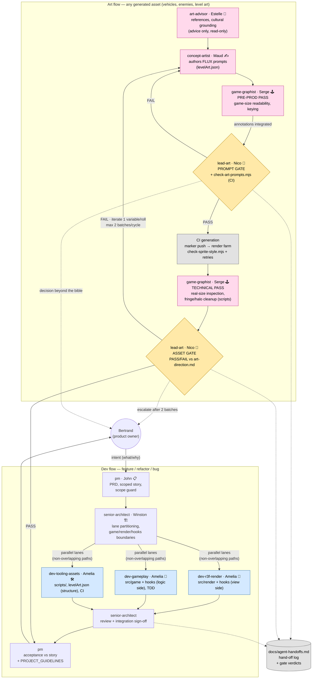

# Agent Workflows — Subagent Crew Orchestration

Visual companion to [`.claude/agents/COLLABORATION.md`](../../.claude/agents/COLLABORATION.md)
(the normative protocol). Two flows: the **dev flow** for any feature/refactor/bug, and the
**art flow** for any generated asset. Every gate verdict and hand-off is logged in
[`agent-handoffs.md`](../agent-handoffs.md).

## How to read it

- **Dev flow** (blue): Bertrand states an intent → `pm` turns it into a scoped story →
  `senior-architect` decides the "how" and partitions three parallel lanes on
  non-overlapping paths (`dev-r3f-render`, `dev-gameplay`, `dev-tooling-assets`) →
  architect review → product acceptance. The only routinely shared seam between dev
  lanes is `src/hooks/**`, which must be serialised (announce, don't co-edit).
- **Art flow** (pink): the pipeline for every generated asset, with two production
  passes by `game-graphist` (Serge) bracketing CI generation, and two blocking gates
  held by `lead-art` (Nico, yellow): the **prompt gate** before any prompt commit to
  `levelArt.json`, and the **asset gate** after generation. On FAIL, `concept-artist`
  iterates (one variable per roll, max two batches per cycle before escalating options
  to Bertrand).
- Dotted arrows are escalations to Bertrand and logging: every gate verdict and
  hand-off is recorded in [`agent-handoffs.md`](../agent-handoffs.md).
