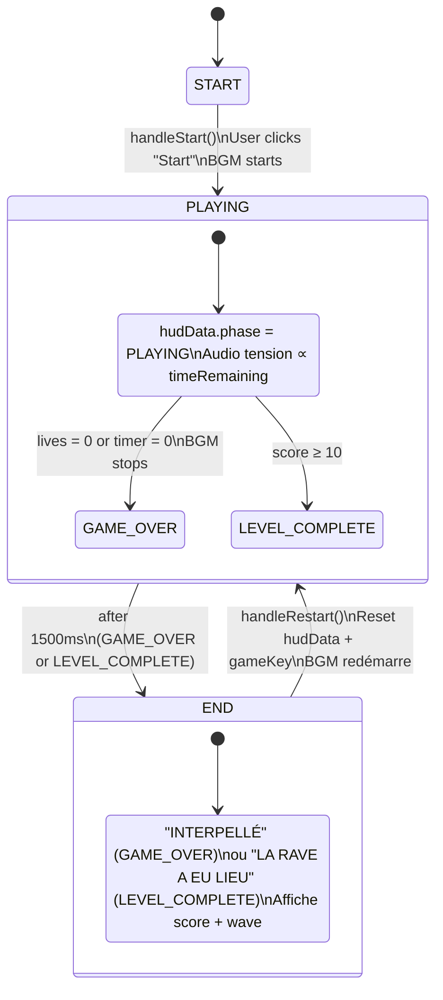

# App Phase Flow

```mermaid
stateDiagram-v2
    [*] --> START

    START --> PLAYING : handleStart()\nUser clicks "Start"\nBGM starts

    state PLAYING {
        [*] --> ACTIVE
        ACTIVE : hudData.phase = PLAYING\nAudio tension ∝ timeRemaining
        ACTIVE --> GAME_OVER : lives = 0 or timer = 0\nBGM stops
        ACTIVE --> LEVEL_COMPLETE : score ≥ 10
    }

    PLAYING --> END : after 1500ms\n(GAME_OVER or LEVEL_COMPLETE)

    state END {
        [*] --> END_SCREEN
        END_SCREEN : "INTERPELLÉ" (GAME_OVER)\nou "LA RAVE A EU LIEU" (LEVEL_COMPLETE)\nAffiche score + wave
    }

    END --> PLAYING : handleRestart()\nReset hudData + gameKey\nBGM redémarre
```
