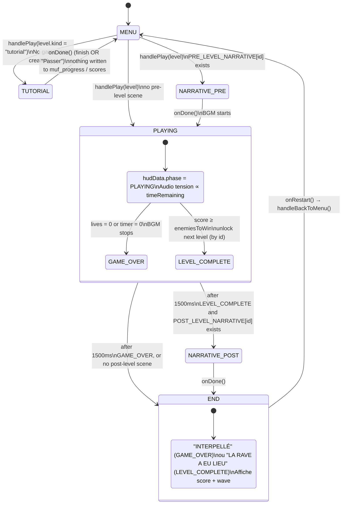

# App Phase Flow

`App.tsx` orchestrates the front-end through `AppPhase`
(`"MENU" | "NARRATIVE_PRE" | "PLAYING" | "NARRATIVE_POST" | "END" | "TUTORIAL"`).
The optional scripted tutorial (ADR-0012) is a side branch off the menu that never
touches game state.

