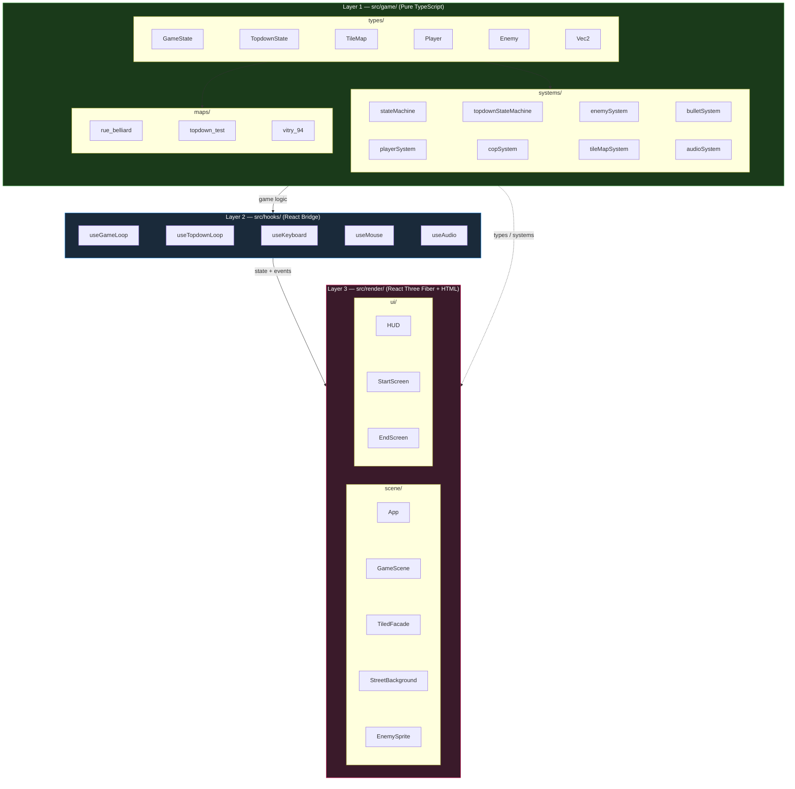

# Architecture Layers

```mermaid
flowchart TD
    subgraph L1["Layer 1 — src/game/ (Pure TypeScript)"]
        direction TB
        subgraph types["types/"]
            T1[GameState] ~~~ T2[TopdownState] ~~~ T3[TileMap] ~~~ T4[Player] ~~~ T5[Enemy] ~~~ T6[Vec2]
        end
        subgraph systems["systems/"]
            S1[stateMachine] ~~~ S2[topdownStateMachine] ~~~ S3[enemySystem] ~~~ S4[bulletSystem]
            S5[playerSystem] ~~~ S6[copSystem] ~~~ S7[tileMapSystem] ~~~ S8[audioSystem]
        end
        subgraph maps["maps/"]
            M1[rue_belliard] ~~~ M2[topdown_test] ~~~ M3[vitry_94]
        end
        types --> systems
        types --> maps
    end

    subgraph L2["Layer 2 — src/hooks/ (React Bridge)"]
        H1[useGameLoop] ~~~ H2[useTopdownLoop] ~~~ H3[useKeyboard] ~~~ H4[useMouse] ~~~ H5[useAudio]
    end

    subgraph L3["Layer 3 — src/render/ (React Three Fiber + HTML)"]
        subgraph scene["scene/"]
            R1[App] ~~~ R2[GameScene] ~~~ R3[TiledFacade] ~~~ R4[StreetBackground] ~~~ R5[EnemySprite]
        end
        subgraph ui["ui/"]
            U1[HUD] ~~~ U2[StartScreen] ~~~ U3[EndScreen]
        end
    end

    L1 -->|game logic| L2
    L2 -->|state + events| L3
    L1 -.->|types / systems| L3

    style L1 fill:#1a3a1a,stroke:#4caf50,color:#fff
    style L2 fill:#1a2a3a,stroke:#2196f3,color:#fff
    style L3 fill:#3a1a2a,stroke:#e91e63,color:#fff
```
