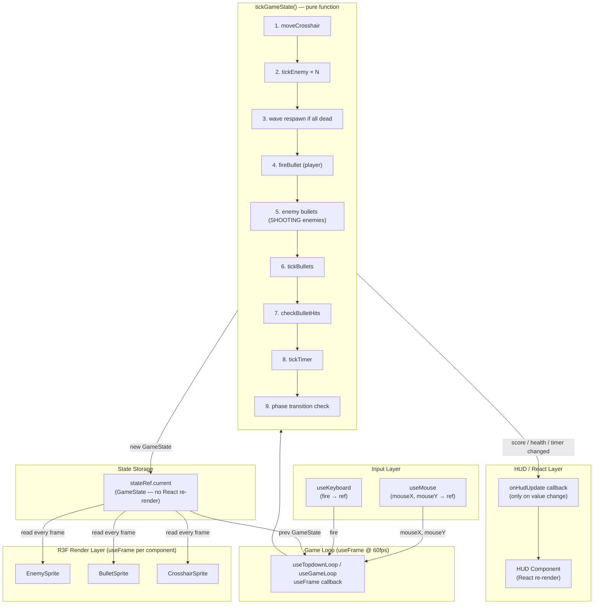

# Data Flow — Game Loop

```mermaid
flowchart TD

  subgraph Input["Input Layer"]
    MOUSE["useMouse\n(mouseX, mouseY → ref)"]
    KEYBOARD["useKeyboard\n(fire → ref)"]
  end

  subgraph Loop["Game Loop (useFrame @ 60fps)"]
    USEFRAME["useTopdownLoop / useGameLoop\nuseFrame callback"]
  end

  subgraph Tick["tickGameState() — pure function"]
    direction TB
    T1["1. moveCrosshair"]
    T2["2. tickEnemy × N"]
    T3["3. wave respawn if all dead"]
    T4["4. fireBullet (player)"]
    T5["5. enemy bullets (SHOOTING enemies)"]
    T6["6. tickBullets"]
    T7["7. checkBulletHits"]
    T8["8. tickTimer"]
    T9["9. phase transition check"]
    T1 --> T2 --> T3 --> T4 --> T5 --> T6 --> T7 --> T8 --> T9
  end

  subgraph State["State Storage"]
    STATEREF["stateRef.current\n(GameState — no React re-render)"]
  end

  subgraph Render["R3F Render Layer (useFrame per component)"]
    ENEMY["EnemySprite"]
    BULLET["BulletSprite"]
    CROSSHAIR["CrosshairSprite"]
  end

  subgraph HUD["HUD / React Layer"]
    HUDCB["onHudUpdate callback\n(only on value change)"]
    HUDCOMP["HUD Component\n(React re-render)"]
  end

  MOUSE -->|mouseX, mouseY| USEFRAME
  KEYBOARD -->|fire| USEFRAME
  STATEREF -->|prev GameState| USEFRAME
  USEFRAME --> Tick
  Tick -->|new GameState| STATEREF
  STATEREF -->|read every frame| ENEMY
  STATEREF -->|read every frame| BULLET
  STATEREF -->|read every frame| CROSSHAIR
  Tick -->|score / health / timer changed| HUDCB
  HUDCB --> HUDCOMP
```
