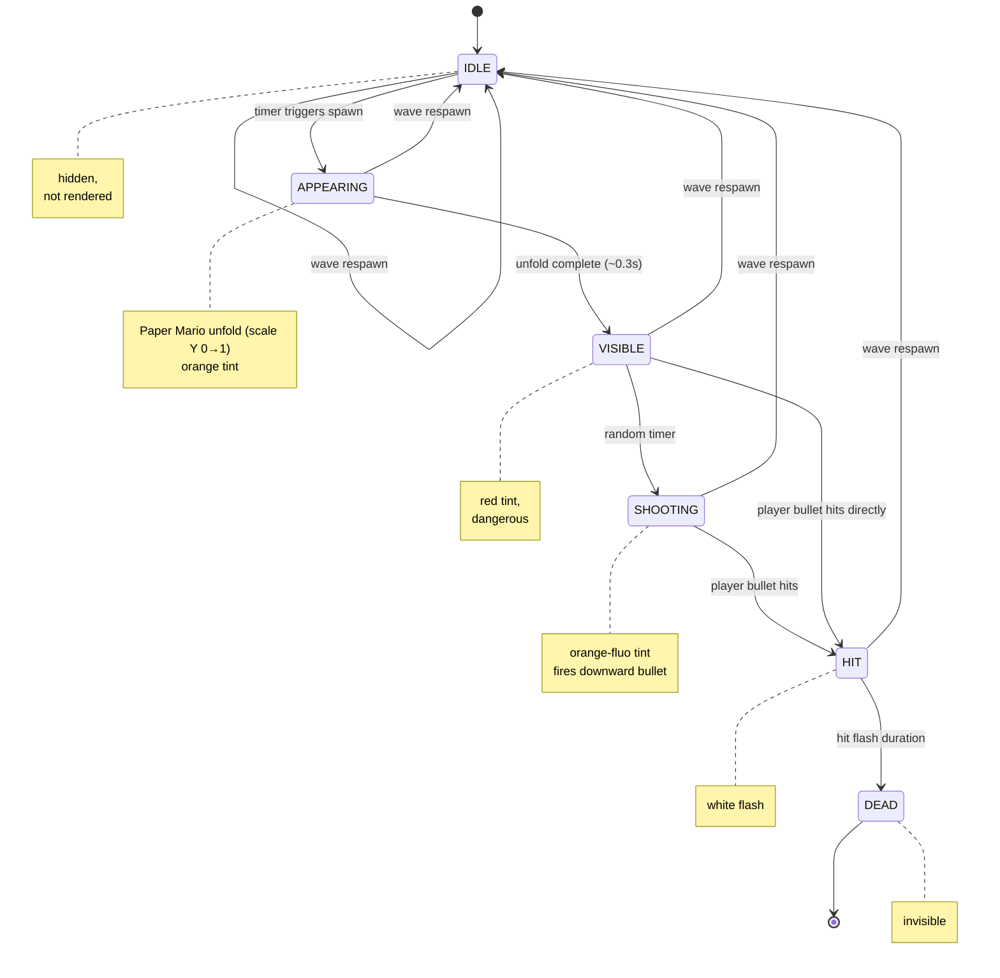

# Enemy State Machine

```mermaid
stateDiagram-v2
    [*] --> IDLE

    IDLE --> APPEARING : timer triggers spawn
    APPEARING --> VISIBLE : unfold complete (~0.3s)
    VISIBLE --> SHOOTING : random timer
    SHOOTING --> HIT : player bullet hits
    VISIBLE --> HIT : player bullet hits directly
    HIT --> DEAD : hit flash duration
    DEAD --> [*]

    IDLE --> IDLE : wave respawn
    APPEARING --> IDLE : wave respawn
    VISIBLE --> IDLE : wave respawn
    SHOOTING --> IDLE : wave respawn
    HIT --> IDLE : wave respawn

    note right of IDLE
        hidden,
 not rendered
    end note
    note right of APPEARING
        Paper Mario unfold (scale Y 0→1)
        orange tint
    end note
    note right of VISIBLE
        red tint,
 dangerous
    end note
    note right of SHOOTING
        orange-fluo tint
        fires downward bullet
    end note
    note right of HIT
        white flash
    end note
    note right of DEAD
        invisible
    end note
```
