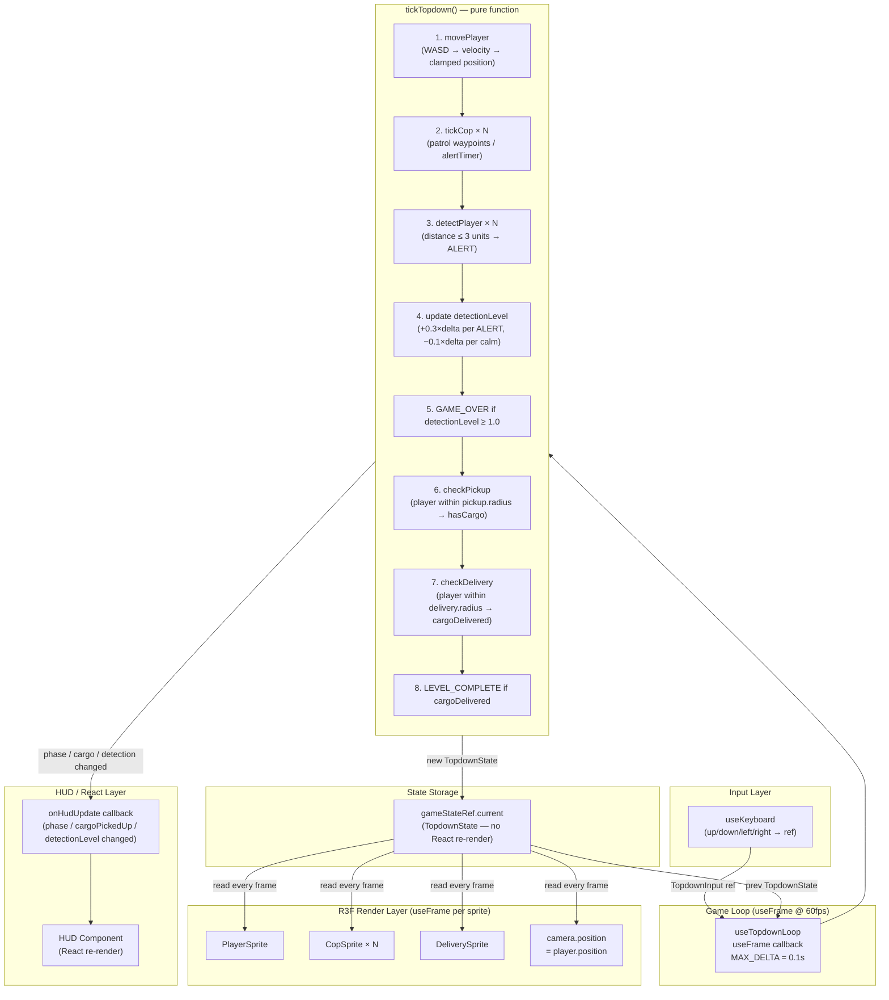

# Data Flow — Top-down Game Loop

```mermaid
flowchart TD

  subgraph Input["Input Layer"]
    KEYBOARD["useKeyboard\n(up/down/left/right → ref)"]
  end

  subgraph Loop["Game Loop (useFrame @ 60fps)"]
    USEFRAME["useTopdownLoop\nuseFrame callback\nMAX_DELTA = 0.1s"]
  end

  subgraph Tick["tickTopdown() — pure function"]
    direction TB
    T1["1. movePlayer\n(WASD → velocity → clamped position)"]
    T2["2. tickCop × N\n(patrol waypoints / alertTimer)"]
    T3["3. detectPlayer × N\n(distance ≤ 3 units → ALERT)"]
    T4["4. update detectionLevel\n(+0.3×delta per ALERT, −0.1×delta per calm)"]
    T5["5. GAME_OVER if detectionLevel ≥ 1.0"]
    T6["6. checkPickup\n(player within pickup.radius → hasCargo)"]
    T7["7. checkDelivery\n(player within delivery.radius → cargoDelivered)"]
    T8["8. LEVEL_COMPLETE if cargoDelivered"]
    T1 --> T2 --> T3 --> T4 --> T5 --> T6 --> T7 --> T8
  end

  subgraph State["State Storage"]
    STATEREF["gameStateRef.current\n(TopdownState — no React re-render)"]
  end

  subgraph Render["R3F Render Layer (useFrame per sprite)"]
    PLAYER["PlayerSprite"]
    COP["CopSprite × N"]
    DELIVERY["DeliverySprite"]
    CAMERA["camera.position\n= player.position"]
  end

  subgraph HUD["HUD / React Layer"]
    HUDCB["onHudUpdate callback\n(phase / cargoPickedUp / detectionLevel changed)"]
    HUDCOMP["HUD Component\n(React re-render)"]
  end

  KEYBOARD -->|TopdownInput ref| USEFRAME
  STATEREF -->|prev TopdownState| USEFRAME
  USEFRAME --> Tick
  Tick -->|new TopdownState| STATEREF
  STATEREF -->|read every frame| PLAYER
  STATEREF -->|read every frame| COP
  STATEREF -->|read every frame| DELIVERY
  STATEREF -->|read every frame| CAMERA
  Tick -->|phase / cargo / detection changed| HUDCB
  HUDCB --> HUDCOMP
```
