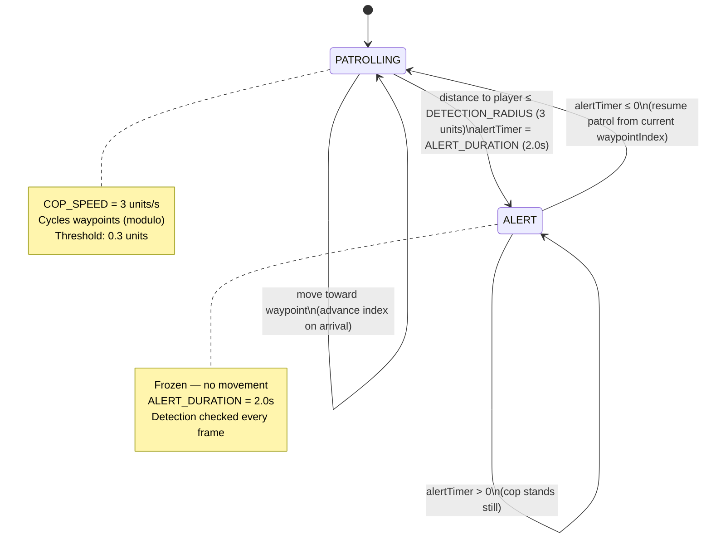
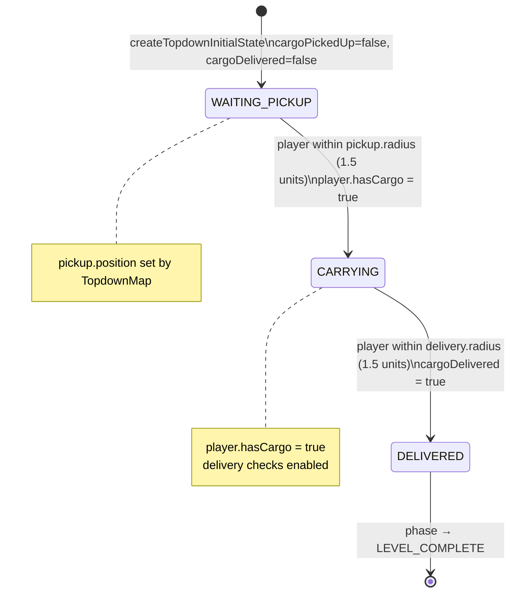
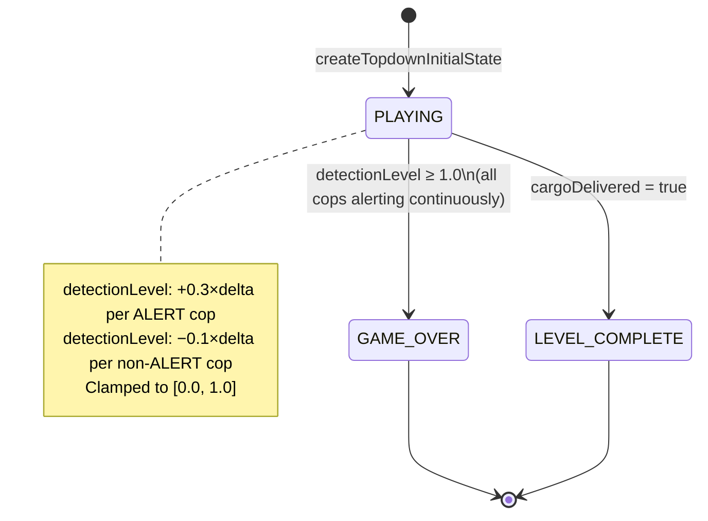

# Top-down State Machines

## Cop State Machine

States: `PATROLLING` | `ALERT`  
Source: `src/game/types/cop.ts`, `src/game/systems/copSystem.ts`

> There is no CHASE state in the current implementation. Cops detect and freeze — they do not pursue.

---

## Delivery State Machine

Source: `src/game/types/delivery.ts`, `src/game/systems/deliverySystem.ts`

---

## Game Phase Machine

Source: `src/game/systems/topdownStateMachine.ts`

