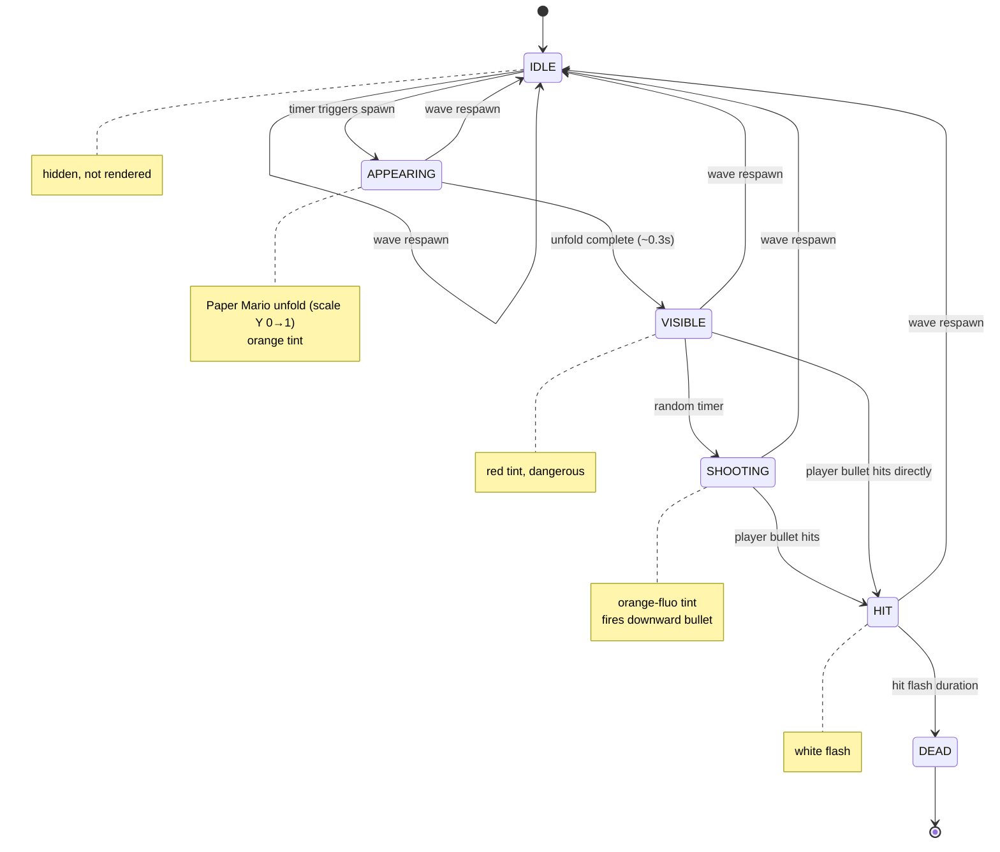

# Game Systems — muf

All systems are pure functions: `(state, input) → newState`. No side effects, fully unit-tested.

---

## Shooting Gallery — State Machine (`stateMachine.ts`)

### GameState

```ts
interface GameState {
  phase: "PLAYING" | "GAME_OVER" | "LEVEL_COMPLETE";
  crosshair: Crosshair; // normalised [0,1] screen position
  enemies: readonly Enemy[];
  bullets: readonly Bullet[];
  score: number;
  lives: number; // starts at 3
  timeRemaining: number; // seconds, starts at 90
  wave: number;
}
```

### `tickGameState(state, fire, mouseX, mouseY, delta, facade, cameraOffsetX, viewW, viewH)`

Called every frame. Order of operations:

1. **Crosshair** — `moveCrosshair(mouseX, mouseY)` → `{x, y}` normalised
2. **Tick enemies** — each enemy advances its internal state timer
3. **Wave respawn** — if all enemies dead, increment wave and spawn new wave
4. **Player fire** — if `fire=true`, create bullet from crosshair world position
5. **Enemy fire** — every SHOOTING enemy emits a downward bullet
6. **Tick bullets** — move all bullets by velocity × delta
7. **Hit detection** — player bullets vs enemy slots, enemy bullets vs player origin
8. **Timer** — decrement; 0 → GAME_OVER
9. **Win condition** — score ≥ `ENEMIES_TO_WIN` (10) → LEVEL_COMPLETE

Constants: `LEVEL_TIME_SECONDS = 90`, `ENEMIES_TO_WIN = 10`, `PLAYER_HIT_RADIUS = 1.0`

---

## Enemy System (`enemySystem.ts`)

### Enemy states



Enemies cycle through a timer-based state machine. `SHOOTING` enemies fire bullets. `spawnWave(wave, facade)` picks random window slots from the `FacadeMap`.

---

## Bullet System (`bulletSystem.ts`)

### `fireBullet(crosshair, fromPlayer, id, cameraOffsetX, viewW, viewH)`

Converts normalised crosshair position `[0,1]` to world coordinates using real viewport dimensions:

```ts
worldX = (crosshair.x - 0.5) * viewW + cameraOffsetX;
worldY = (0.5 - crosshair.y) * viewH;
```

Player bullets travel upward (`velocity.y = +BULLET_SPEED`).  
Enemy bullets travel downward (`velocity.y = -BULLET_SPEED`).

### `checkBulletHits(bullets, enemies, facade)`

For each player bullet, checks proximity against each non-dead enemy's slot world position. Hit radius: 0.6 units.

Bullets that go out of viewport bounds are removed.

---

## Crosshair System (`crosshairSystem.ts`)

`moveCrosshair(mouseX, mouseY)` — maps normalised mouse `[0,1]` to crosshair position. Trivial passthrough; exists for testability and future smoothing.

---

## Timer (`timer.ts`)

`tickTimer(remaining, delta)` — clamps to zero. Returns `0` instead of negative.

---

## Vec2 (`vec2.ts`)

Minimal immutable 2D vector helpers: `add`, `sub`, `scale`, `length`, `normalize`, `dot`.

---

## Test Coverage

Every system has a corresponding `__tests__/*.test.ts` file using Vitest. Tests run with `yarn test`.
