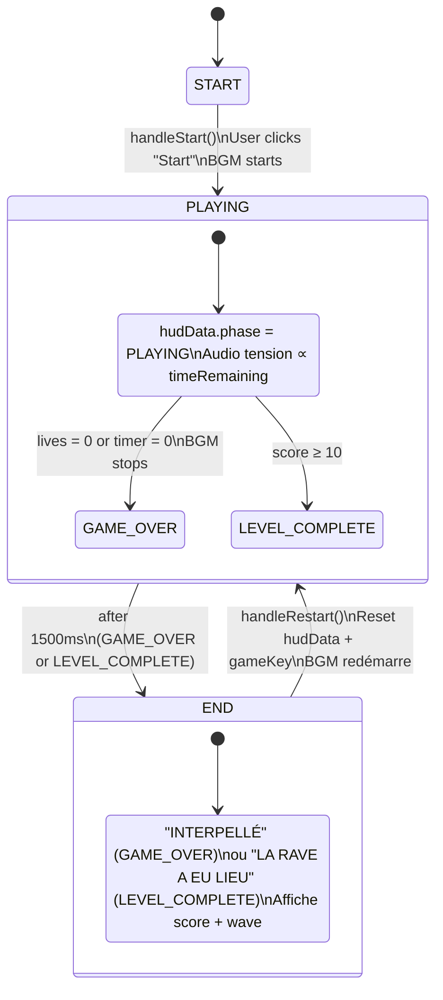

# Render Layer — muf

## Overview

The render layer is React Three Fiber (R3F) with an orthographic camera. All game-visible objects are flat 2D planes (Paper Mario style) rendered in 3D space. There is no perspective projection.

---

## App.tsx — Root

Manages the top-level phase: `START → PLAYING → END`.



- `StartScreen` / `EndScreen` are plain HTML overlays (no R3F)
- `Canvas` wraps the R3F scene with orthographic camera
- Lighting is set here and applies globally
- Audio lifecycle: BGM starts on PLAYING, stops on GAME_OVER, tension driven by `timeRemaining`

### Camera Setup

```ts
onCreated={({ camera, size }) => {
  const STREET_W = 50;  // total street width in world units
  const STREET_H = 18;  // max building height in rows
  const zoomByWidth  = size.width  / STREET_W;
  const zoomByHeight = (size.height - 40) / STREET_H;
  camera.zoom = Math.max(zoomByWidth, zoomByHeight);
  // Start showing bottom of facade + road strip
  const viewH = size.height / camera.zoom;
  camera.position.y = -(STREET_H / 2) - 1.5 + viewH / 2;
  camera.updateProjectionMatrix();
}}
```

### Lighting

| Light              | Position      | Intensity | Notes                            |
| ------------------ | ------------- | --------- | -------------------------------- |
| `ambientLight`     | —             | 2.2       | Neutral white, main fill         |
| `directionalLight` | `[-12, 2, 4]` | 0.8       | Rasant left — stone joint relief |
| `directionalLight` | `[10, -1, 3]` | 0.2       | Blue counter-light from right    |

---

## GameScene.tsx — Shooting Gallery

Builds the multi-building street from `RUE_BELLIARD` (4 buildings, bottom-aligned).

**Data prep (module-level, runs once):**

- `buildingLayouts` — computes world `offsetX` and `FacadeMap` per building, re-centred around x=0
- `MERGED_FACADE` — all window slots merged for the game loop
- `FACADE_W = 50`, `FACADE_H = STREET_HEIGHT = 18`

**Per-frame scroll (useFrame):**

- Horizontal: mouse edge zones trigger X scroll, clamped to `[-(FACADE_W-viewW)/2, +(FACADE_W-viewW)/2]`
- Vertical: mouse edge zones trigger Y scroll, clamped to include 4 extra road units below buildings

**Children:**

- `StreetBackground` — sky + pavement behind buildings
- `TiledFacade` × 4 — one per building
- `EnemySprite` × N — one per window slot
- `BulletSprite` — renders all bullets from stateRef
- `CrosshairSprite` — follows mouse in world space

---

## TiledFacade.tsx — Procedural Facade

Renders a `TileMap` as a Canvas2D texture with a normal map, **plus real 3D geometry** for architectural depth.

**Props:** `map: TileMap`, `worldOffsetX?: number`, `streetHeight?: number`

### Texture pipeline

1. `makeFacadeCanvas(map)` — draws all tiles procedurally on an `HTMLCanvasElement` (80px per tile)
2. `makeNormalMap(diffuseCanvas)` — Sobel filter on luminance → RGB normal map (strength = 10)
3. Main plane: `meshStandardMaterial` with `normalMap`, `normalScale={[2.5, 2.5]}`, `roughness={0.6}`

### 3D depth geometry (overlaid on the facade plane)

Each building emits additional meshes that physically protrude from the facade:

| Element            | Geometry                         | Depth      | Purpose                                                |
| ------------------ | -------------------------------- | ---------- | ------------------------------------------------------ |
| Cornice bands      | `boxGeometry` per floor boundary | 0.22 units | Catches directional light, casts shadow on floor below |
| Soubassement       | `boxGeometry` at building base   | 0.35 units | Heavier base mass, more prominent shadow               |
| Right-edge shadow  | thin `planeGeometry`             | z -0.1     | Simulates shadow gap between adjacent buildings        |
| Top-edge dark band | thin `planeGeometry`             | z -0.1     | Sky-meets-rooftop transition                           |

Constants defined at module level: `CORNICE_DEPTH = 0.22`, `CORNICE_H = 0.12`, `BASE_DEPTH = 0.35`, `BASE_H = 0.18`.

### Tile rendering — each `TileType` has a dedicated Canvas2D draw function:

- `WALL` — stone blocks with Sobel-derived joint lines, occasional graffiti / moisture stains / pipes / posters
- `WINDOW_LIT` — glowing interior (10 warm/cool light variants), radial gradient, silhouette overlay (35% chance)
- `WINDOW_DARK` — 5 dark variants: void, half-open shutters, night-sky reflection, drawn curtain, neon green reflection
- `BALCONY` — wrought-iron railing, random plant or laundry
- `DOOR` — arched double door, intercom, floor light halo
- `ROOFTOP` — zinc parapet, random TV antenna (25%) or chimney (20%)
- `SHOP` — commercial signage band
- `FIRE_ESCAPE` — diagonal metal ladder on wall with rust patches
- `ARCH` — Haussmannian decorative arch with keystones and pilasters

### Bottom-alignment

Building base sits at `y = -(streetHeight/2)` in world space regardless of building height.  
Formula: `mesh_centre_y = yOffset = -((streetHeight - map.rows) * tileH) / 2`

---

## StreetBackground.tsx

Renders a `height × width` plane behind the buildings (`z = -1`).

Canvas2D content: 72% sky (deep blue gradient + stars), 28% pavement (dark concrete + slab joints + neon reflection).

`groundY` prop positions the sky/pavement join in world space. `meshY` is computed so the join lands at exactly `groundY`.

---

## Sprites

All sprites are `<mesh position={[x, y, z]}><planeGeometry /><meshBasicMaterial /></mesh>` planes facing the camera.

| Component         | Source data                         | Z depth |
| ----------------- | ----------------------------------- | ------- |
| `EnemySprite`     | `stateRef.current.enemies[i]`       | 1       |
| `BulletSprite`    | `stateRef.current.bullets`          | 2       |
| `CrosshairSprite` | mouse position via camera unproject | 3       |
| `PlayerSprite`    | `TopdownState.player`               | 1       |
| `CopSprite`       | `TopdownState.cops[i]`              | 1       |
| `DeliverySprite`  | `TopdownState.delivery`             | 1       |

---

## HUD

Plain HTML `<div>` overlay, absolutely positioned over the Canvas. Displays score, lives, timer, wave. Re-renders only when `HudData` changes (pushed via `onHudUpdate` callback, not a game state subscription).
