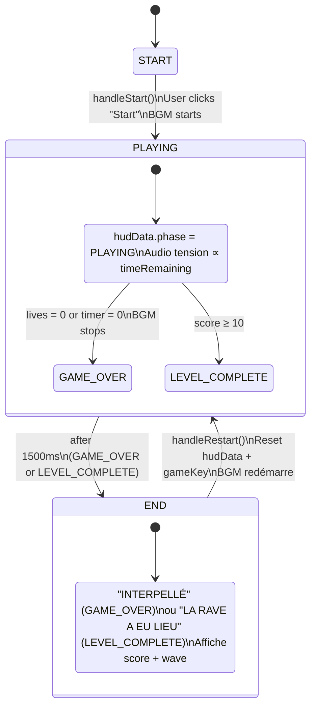

# Render Layer — muf

## Overview

The render layer is React Three Fiber (R3F) with an orthographic camera. All game-visible objects are flat 2D planes (Paper Mario style) rendered in 3D space. There is no perspective projection.

---

## App.tsx — Root

Manages the top-level phase: `START → PLAYING → END`.


```mermaid
stateDiagram-v2
    [*] --> START

    START --> PLAYING : handleStart()\nUser clicks "Start"\nBGM starts

    state PLAYING {
        [*] --> ACTIVE
        ACTIVE : hudData.phase = PLAYING\nAudio tension ∝ timeRemaining
        ACTIVE --> GAME_OVER : lives = 0 or timer = 0\nBGM stops
        ACTIVE --> LEVEL_COMPLETE : score ≥ 10
    }

    PLAYING --> END : after 1500ms\n(GAME_OVER or LEVEL_COMPLETE)

    state END {
        [*] --> END_SCREEN
        END_SCREEN : "INTERPELLÉ" (GAME_OVER)\nou "LA RAVE A EU LIEU" (LEVEL_COMPLETE)\nAffiche score + wave
    }

    END --> PLAYING : handleRestart()\nReset hudData + gameKey\nBGM redémarre
```

- `TitleScreen` / `EndScreen` are plain HTML overlays (no R3F)
- `Canvas` wraps the R3F scene with orthographic camera
- Lighting is set here and applies globally
- Audio lifecycle: BGM starts on PLAYING,
  stops on GAME_OVER,
  tension driven by `timeRemaining`

### Camera Setup

```ts
onCreated={({ camera,
 size }) => {
  const STREET_W = 50;  // total street width in world units
  const STREET_H = 18;  // max building height in rows
  const zoomByWidth  = size.width  / STREET_W;
  const zoomByHeight = (size.height - 40) / STREET_H;
  camera.zoom = Math.max(zoomByWidth,
 zoomByHeight);
  // Start showing bottom of facade + road strip
  const viewH = size.height / camera.zoom;
  camera.position.y = -(STREET_H / 2) - 1.5 + viewH / 2;
  camera.updateProjectionMatrix();
}}
```

### Lighting

| Light              | Position | Intensity | Notes          |
| ------------------ | -------- | --------- | -------------- |
| `ambientLight`     | —        | 2.2       | Neutral white, |
| main fill          |
| `directionalLight` | `[-12,   |

2,
4]`| 0.8       | Rasant left — stone joint relief |
|`directionalLight`|`[10,
-1,
3]` | 0.2 | Blue counter-light from right |

---

## GameScene.tsx — Shooting Gallery

Builds the street from the active level's art (`getLevelArt(levelId)`),
laid out as `PANELS` (4) facade panels placed side by side.

**Data prep:**

- `panelW = WORLD_HEIGHT * FACADE_ASPECT`,
  `fullW = panelW * PANELS`
- Enemy slots from the level's hand-authored window zones:
  `computeSlotsFromZones(tileZones(baseZones, PANELS), fullW, facadeH)`

**Children:**

- `LevelBackdrop` — sky + N facade panels + street (see below)
- `EnemySprite` × N — one per window slot
- `ForegroundFrames` × PANELS — per-panel window framing overlays
- `BulletSprite` — renders all bullets from stateRef
- `CrosshairSprite` — follows mouse in world space

---

## LevelBackdrop.tsx — Level Art

Renders a level as a wide street from pre-generated PNG layers under
`public/assets/levels/<id>/`:

- **sky** — one wide plane, farthest (`z = -3`), parallaxes slowest
- **facade** — `PANELS` panels side by side (`facade.png`, `facade_2.png` …),
  each its own world-locked plane (`z = -1`)
- **street** — repeated band behind the facade (`z = -2`)

Adjacent facade panels overlap by `BLEND` (8%) and the front panel's left edge
is alpha-feathered (`featherLeftTexture`) so the seam crossfades instead of
showing a hard vertical line. All textures pass through `applyPixelFilter`
(nearest-neighbour, sRGB) to keep the 16-bit look. Missing panels fall back to
`facade.png`; missing layers fall back to flat colours.

---

## StreetBackground.tsx

Renders a `height × width` plane behind the buildings (`z = -1`).

Canvas2D content: 72% sky (deep blue gradient + stars),
28% pavement (dark concrete + slab joints + neon reflection).

`groundY` prop positions the sky/pavement join in world space. `meshY` is computed so the join lands at exactly `groundY`.

---

## Sprites

All sprites are `<mesh position={[x,
 y,
 z]}><planeGeometry /><meshBasicMaterial /></mesh>` planes facing the camera.

| Component         | Source data                         | Z depth |
| ----------------- | ----------------------------------- | ------- |
| `EnemySprite`     | `stateRef.current.enemies[i]`       | 1       |
| `BulletSprite`    | `stateRef.current.bullets`          | 2       |
| `CrosshairSprite` | mouse position via camera unproject | 3       |
| `PlayerSprite`    | `TopdownState.player`               | 1       |
| `CopSprite`       | `TopdownState.cops[i]`              | 1       |
| `DeliverySprite`  | `TopdownState.delivery`             | 1       |
| `CourierSprite`   | `stateRef.current.couriers[i]`      | 0.65    |

### Courier composite

`CourierSprite` draws ONE **rider** plane per pooled courier (pedalling flipbook).
Its depth slot is not a local literal: it comes from `STREET_DEPTH.courier` in
`src/render/scene/streetDepth.ts` — **renderOrder 5.5, z 0.65**, i.e. between the
two near-foreground kerb rows (far row 4 / z 0.60, near row 5.75 / z 0.70), above
the facade-attached ironwork (`ForegroundFrames` / `WindowGrilles`, renderOrder 5 /
z 0.50) and — since 2026-07-25 — **in front of** `DeliveryVehicleSprite`
(rim 5.2 / z 0.61, body 5.25 / z 0.62), which reads its own slots from the same
table. See ADR-0047 amendment 4 for the arbitration: the NEAR row may partially
mask a livreur AND the van, the facade ironwork never may. Frame counts, fps, and
per-layer `scale`/`offsetY`
registration knobs come from `courier.layers` in `levelArt.json` via
`courierTextures.ts`; the id-phased clock keeps couriers out of lockstep. Until the
rider's frame-1 PNG exists (generated later in CI, gated by `courierArtReady()`),
the plane stays hidden.

### Enemy flipbook

`EnemySprite` plays a short 2-frame flip per state (idle sway, muzzle recoil). The pure, DOM-free helper `flipbook.ts` (`flipbookFrame(elapsed, frameCount, fps)`) maps a per-state clock to a 1-based frame index. Frame counts are manifest-driven: `enemyTextures.ts` reads `enemies.types[<baseFile>].frames.length` and the shared `enemies.fps` from `levelArt.json` (the base-file key is exactly what `fileFor` builds). Frame 1 is the committed unsuffixed PNG; extra frames are `<baseFile>_f<N>.png` (generated later in CI). A missing frame degrades to frame 1, then to the global cop fallback, so the sprite is never blank; `HIT` pins frame 1 while the white flash dominates.

---

## HUD

Plain HTML `<div>` overlay,
absolutely positioned over the Canvas. Displays score,
lives,
timer,
wave. Re-renders only when `HudData` changes (pushed via `onHudUpdate` callback,
not a game state subscription).
